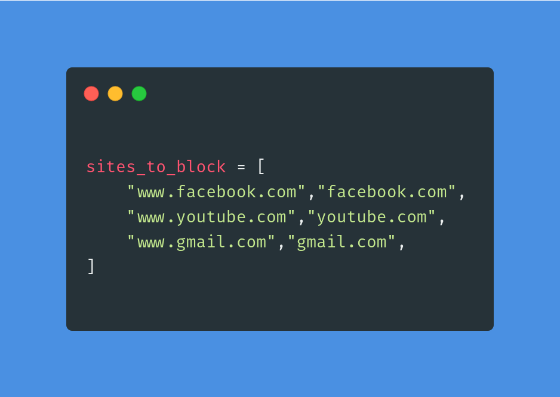
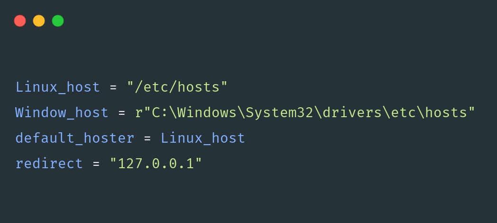

# Website-blocker-python


Intro 
------------

Hi Guys 👋 

This repo consist of a code of a simple website blocker project implemented in Python, It can be used to block certain websites during working time to reduce distraction thus improving productivity


The magic 
--------------

The magic of this project lies on modifying the host file withing your 
computer that manages how you access the web 

Getting started 
---------------------

Well getting started with this project just clone the clone the repo 
and edit the host file location depending on the OS your using 

```bash
    $-> git clone https://github.com/Kalebu/Website-blocker-python
    $-> cd Website-blocker-python
    $ Website-blocker-python ->
```

Adding sites to block + Editing host files 
------------------------------------------------

Now open the *app.py* and the goto line 4 with variable *site_to_block*
and you can add the sites you would like to block during work time



Also when you go to the line no 12 and edit default host depending on 
Operating System you're using 



One more thing 
-------------------

You would need to set up the starting working + ending working hours where you would like to be restricted accessing those websites
To do this go to line last line of our code and edit the hours where by


Congratulations 
--------------------

Well done you now have a fully functioning website blocker you have made yourself to improve the productivity in Python 

Issues 
-----------

Incase you have any difficulties or issues while trying to run the script
you can raise it on the issues 

Pull Requests
----------------

If you have something to add I welcome pull requests on improvement , you're helpful contribution will be merged as soon as possible 


Give it a Star ✴️
--------------------
If you find this repo useful , give it a star

Credits
-----------
All the credits to [kalebu](github.com/kalebu)